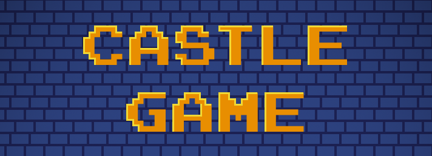

    
     

 

Just a game I made way back

## Controls

`W` `A` `S` `D` or the arrow keys - Move

`Q` - Change weapon

`E` - Interact

`R` - Open inventory

`space` - Hit

`esc` - Pause / Close inventory

## Stats Bar

     

### Health

The purple monsters are gonna be a huge drag. Use potions to heal yourself. 
There are light, regular and strong versions of the potion. Regenerating 25, 50 and 100 health respectively.

 

    

### Strength
You thought you can kill the monsters with your bare hands. Well, aren't ya tough?
Use weapons to increase your strength and drink regular and strong strength potions to boost it.

 

    
    

### Gold and Rubies

Eh, they are useless (yet), but who doesn't like to collect gold and rubies?

## Updates

soon.

 

    
    
    
     

